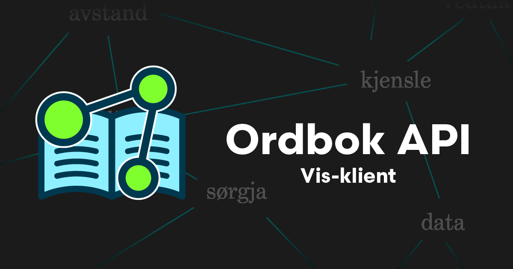

# Ordbok API Vis-klient



<p align="center">
  <a href="https://vis.ordbokapi.org">Nettstad</a> •
  <a href="https://ordbokapi.org">Prosjektnettstad</a> •
  <a href="https://github.com/ordbokapi/api">API på GitHub</a>
</p>

## Om

Vis-klienten er ein graf-basert grafisk brukargrensesnitt for å utforske data frå [Ordbok API](https://ordbokapi.org). Klienten er skriven med TypeScript og webkomponentar.

## Starte prosjektet lokalt

Du treng [Node.js](https://nodejs.org) og [Yarn](https://yarnpkg.com) installert.

> Viss du brukar [Volta](https://volta.sh) treng du ikkje å installere Node.js. Volta vil bruke den versjonen av Node.js som er spesifisert i `package.json` når du køyrer `yarn` eller `node`-kommandoar i prosjektmappa.

```bash
git clone https://github.com/ordbokapi/vis-client.git
cd vis-client
yarn
yarn start
```

## Lisens

[ISC](LICENCE)
